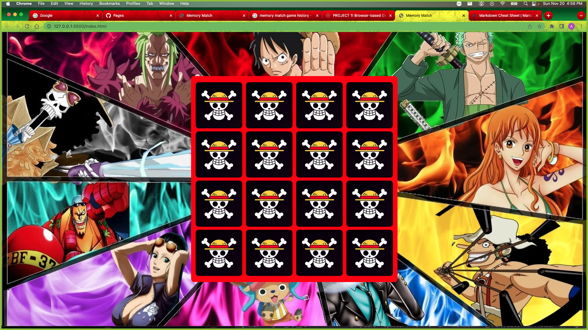

# **Memory-Match**
    - The memory match game can be traced back as far as the 16th century in Japan. They would match paintings on shells and in todays form it was published in 1960 by Ravensburger. 

## Screen Shots

    

## Technologies Used
    - HTML
    - CSS
    - JavaScript

## Getting Started

    - The basic rules consist of turning over a card or some kind of object and matching the image thats on the other side. You can have a variety of different images and also change how many pairs you want your game to have.

    - You win the game once you have successfully matched all the cards faced up. If you dont match a pair when you turn them over, simply put them back faced down and try again when its your turn. 

    - https://shadowtorn33.github.io/Memory-Match/

## Next Steps
    Some features I would still like to add are:
        - Shuffle feature to make the game more fun.
        - Make the game more responsive so that you can play it on your mobile device.
        - Id like to add some basic features like a move counter and maybe a timer to keep track of how long it takes you to match.
        - Background music.
